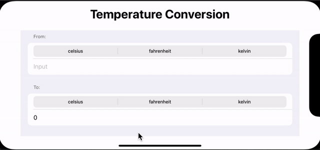

## Challege project #1. 
You need to build an app that handles unit conversions: users will select an input unit and an output unit, then enter a value, and see the output of the conversion.
Which units you choose are down to you, but you could choose one of these:
- Temperature conversion: users choose Celsius, Fahrenheit, or Kelvin.

### Image

